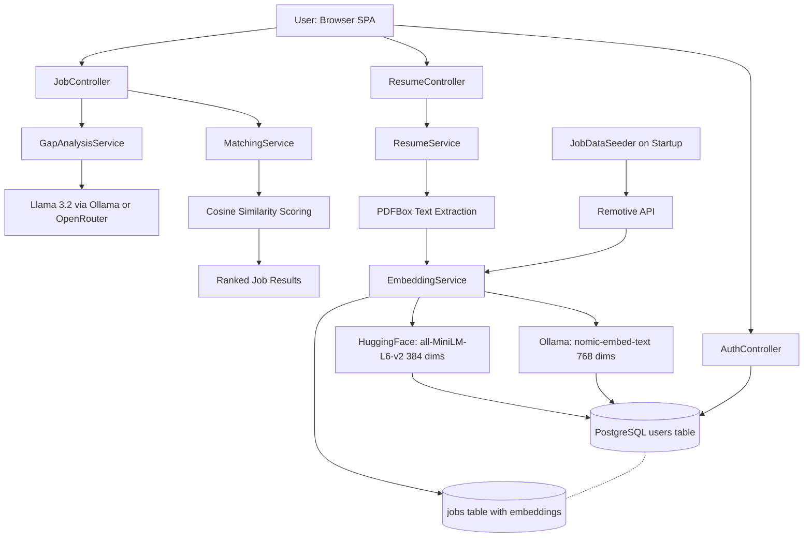

# ProximaHire

<div align="center">

### AI-Powered Semantic Job Matching Platform

[](https://proximahire.onrender.com)
[](https://github.com/ashish-babu-03/ProximaHire)


</div>

---

## What is ProximaHire?

ProximaHire is a **full-stack AI job matching platform** that goes far beyond keyword filtering. Upload your PDF resume, and the system instantly converts it into a semantic vector embedding, compares it against every job in the database using cosine similarity, and surfaces your best matches — color-coded green, orange, or red.

Didn't get the job you wanted? Hit **Analyse Gap** and a local Llama 3.2 (or OpenRouter in production) reads both your resume and the job description and generates a concise gap report: your match percentage, where you're strong, and exactly what's missing.

Everything runs on a **RAG (Retrieval-Augmented Generation) pipeline** implemented from scratch in Kotlin — no LangChain, no magic frameworks, just clean architecture and real AI.

---

## How the RAG Pipeline Works

At its core, ProximaHire treats both resumes and job descriptions as **points in a high-dimensional vector space**. The closer two points are, the more semantically similar they are — regardless of whether they use the exact same words.

```
Resume PDF
    │
    ▼
PDFBox Text Extraction
    │
    ▼
EmbeddingService → nomic-embed-text (Ollama) / all-MiniLM-L6-v2 (HuggingFace)
    │                    ↓
    │              float4[] column in PostgreSQL (768-dim or 384-dim)
    │
    ▼
MatchingService: cosine_similarity(resume_vec, job_vec) × 100 → score 0–100
    │
    ├── score > 70  → 🟢 GREEN  (strong match)
    ├── score 40–70 → 🟠 ORANGE (partial match)
    └── score < 40  → 🔴 RED    (weak match)
    
Gap Analysis:
    resume_text + job_description_text → LLM prompt → Llama 3.2 / OpenRouter
         └── Structured report: Match %, Strong Areas, Missing Skills
```

---

## Architecture



---

## Tech Stack

| Layer | Technology | Role |
|---|---|---|
| **Language** | Kotlin 1.9 | Primary language — concise, null-safe, coroutine-ready |
| **Framework** | Spring Boot 3.3.5 | Web layer, DI, security, lifecycle |
| **Database** | PostgreSQL | Persistent storage for users, resumes, jobs |
| **Vector Storage** | `float4[]` column | Stores embedding arrays natively in Postgres |
| **Migrations** | Liquibase | Schema versioning, `db.changelog-master.yaml` |
| **Auth** | Spring Security + JWT | Stateless token-based auth via `OAuth2ResourceServer` |
| **Embeddings (local)** | Ollama + `nomic-embed-text` | 768-dim local embeddings, zero latency |
| **Embeddings (prod)** | HuggingFace Inference Router | `all-MiniLM-L6-v2`, 384-dim, serverless |
| **LLM (local)** | Ollama + Llama 3.2 | Gap analysis with streaming NDJSON |
| **LLM (prod)** | OpenRouter API | `meta-llama/llama-3.2-3b-instruct:free` |
| **PDF Parsing** | Apache PDFBox | Extracts raw text from uploaded PDF resumes |
| **HTTP Client** | Spring WebFlux `WebClient` | Non-blocking calls to Ollama, HuggingFace, OpenRouter |
| **Job Data** | Remotive API | Live remote job listings fetched on startup |
| **Containerisation** | Docker (multi-stage) | `gradle:8-jdk21` build → `eclipse-temurin:21-jre-alpine` runtime |
| **Deployment** | Render | Cloud hosting, environment variable injection |

---

## API Endpoints

| Method | Endpoint | Auth | Description |
|---|---|---|---|
| `POST` | `/api/auth/register` | ❌ Public | Register with email + password (role: `CANDIDATE`) |
| `POST` | `/api/auth/login` | ❌ Public | Login, returns JWT token |
| `POST` | `/api/resumes/upload` | ✅ JWT | Upload PDF resume → parse → embed → store |
| `GET` | `/api/jobs` | ✅ JWT | Get all jobs with cosine similarity match scores |
| `POST` | `/api/jobs/search` | ✅ JWT | Semantic search: `{"query": "your natural language query"}` |
| `GET` | `/api/jobs/{id}/gap-analysis` | ✅ JWT | LLM gap analysis for a specific job vs user's resume |

### Example: Semantic Search

```bash
curl -X POST https://proximahire.onrender.com/api/jobs/search \
  -H "Authorization: Bearer <your-token>" \
  -H "Content-Type: application/json" \
  -d '{"query": "backend engineer with distributed systems and Kafka experience"}'
```

### Example: Gap Analysis Response

```json
{
  "report": "**Estimated Match Percentage:** 72%\n\n**Strong Areas:**\n- 5 years of backend Java/Kotlin development\n- Spring Boot microservices experience\n- PostgreSQL and database optimisation\n\n**Missing Skills:**\n- Apache Kafka (event streaming)\n- Kubernetes/container orchestration\n- AWS cloud infrastructure experience"
}
```

---

## Running Locally

### Prerequisites

- JDK 21+
- PostgreSQL 14+
- [Ollama](https://ollama.ai) installed and running
- Gradle 8+

### 1. Pull AI Models

```bash
ollama pull nomic-embed-text   # for embeddings
ollama pull llama3.2           # for gap analysis
```

### 2. Create the Database

```sql
CREATE DATABASE proximahire;
```

> Liquibase will automatically create all tables on first run. No manual SQL needed.

### 3. Configure `application.properties`

```properties
spring.datasource.url=jdbc:postgresql://localhost:5432/proximahire
spring.datasource.username=postgres
spring.datasource.password=your_password

ollama.url=http://localhost:11434
embedding.provider=ollama
embedding.dimensions=768
llm.provider=ollama

jwt.secret=your-secret-key-here
```

### 4. Run the Application

```bash
./gradlew bootRun
```

The application will:
1. Run Liquibase migrations (create tables)
2. Fetch live jobs from Remotive API (150 general + 100 software-dev)
3. Deduplicate and generate AI embeddings for each job
4. Fall back to 50 hardcoded jobs if the API is unavailable
5. Start the web server on `http://localhost:8080`

Open `http://localhost:8080` in your browser to use the SPA frontend.

---

## Running with Docker

```bash
docker build -t proximahire .

docker run -p 8080:8080 \
  -e DATABASE_URL=jdbc:postgresql://host.docker.internal:5432/proximahire \
  -e DATABASE_USERNAME=postgres \
  -e DATABASE_PASSWORD=your_password \
  -e HUGGINGFACE_API_KEY=hf_... \
  -e OPENROUTER_API_KEY=sk-or-... \
  -e JWT_SECRET=your-secret \
  -e SPRING_PROFILES_ACTIVE=prod \
  proximahire
```

---

## Environment Variables

| Variable | Required In | Description |
|---|---|---|
| `DATABASE_URL` | Production | Full JDBC URL to PostgreSQL |
| `DATABASE_USERNAME` | Production | PostgreSQL username |
| `DATABASE_PASSWORD` | Production | PostgreSQL password |
| `JWT_SECRET` | Both | Secret key for signing JWT tokens |
| `HUGGINGFACE_API_KEY` | Production | HuggingFace API key for embeddings |
| `OPENROUTER_API_KEY` | Production | OpenRouter API key for LLM inference |
| `OLLAMA_URL` | Local | Ollama server URL (default: `http://localhost:11434`) |
| `SPRING_PROFILES_ACTIVE` | Production | Set to `prod` to activate production config |

---

## Full User Flow

```
1. Register / Login
   └─ JWT token issued, stored in-memory in browser SPA

2. Upload PDF Resume
   └─ PDFBox extracts raw text
   └─ EmbeddingService generates float vector (768 or 384 dims)
   └─ Stored in PostgreSQL as float4[]

3. View Job Matches (GET /api/jobs)
   └─ MatchingService loads user's resume embedding
   └─ Computes cosine similarity against every job embedding
   └─ Returns sorted list with scores 0–100
   └─ Frontend renders circular SVG progress rings, color-coded

4. Semantic Search (POST /api/jobs/search)
   └─ User types natural language query
   └─ Query is embedded using same embedding model
   └─ Cosine similarity run against all job embeddings
   └─ Top matches returned — no keyword matching involved

5. Gap Analysis (GET /api/jobs/{id}/gap-analysis)
   └─ Fetches job description text and user's resume text
   └─ Builds structured LLM prompt (max 300 words output)
   └─ Streams response from Llama 3.2 / OpenRouter
   └─ Returns: Match %, Strong Areas, Missing Skills
```

---

## Key Engineering Decisions

### Why `float4[]` instead of the `pgvector` extension?

Hibernate's JPA mapping for `pgvector`'s `vector` type requires a custom type adapter and has historically had fragile compatibility with Spring Boot's auto-configuration. Storing embeddings as native `float4[]` arrays in PostgreSQL gives us full Hibernate compatibility with zero custom type registration while still allowing cosine similarity to be computed in Kotlin on the application layer — which is perfectly performant for hundreds to thousands of jobs.

### Why compute cosine similarity in Kotlin instead of SQL?

For this scale (hundreds of jobs, one resume), computing similarity in Kotlin is faster than a round-trip SQL query with a custom distance operator. It also keeps the similarity logic testable in pure unit tests without a database, and makes it trivial to apply additional re-ranking logic (e.g. weighting by company, recency) without touching SQL.

```kotlin
// Cosine similarity — clean, testable, fast
fun cosineSimilarity(a: FloatArray, b: FloatArray): Double {
    val dot = a.zip(b.toList()).sumOf { (x, y) -> (x * y).toDouble() }
    val normA = sqrt(a.sumOf { (it * it).toDouble() })
    val normB = sqrt(b.sumOf { (it * it).toDouble() })
    return if (normA == 0.0 || normB == 0.0) 0.0 else dot / (normA * normB)
}
```

### Why the fallback seeder pattern?

The `JobDataSeeder` implements `ApplicationRunner` and fires on startup. It first attempts to fetch 250 live jobs from the Remotive API (150 general + 100 software-dev), deduplicates by title + company, then generates embeddings for each. If the API is unavailable or returns fewer than 30 jobs, it transparently falls back to 50 carefully crafted hardcoded jobs spanning 12 engineering categories. This ensures the platform is always populated and usable — even in an air-gapped or offline environment.

### Why dual-provider architecture (Ollama / HuggingFace + OpenRouter)?

Running Ollama locally gives engineers zero-cost, zero-latency development with no API rate limits. But production deployments on Render don't have a GPU-accelerated Llama instance available. The `embedding.provider` and `llm.provider` properties let you swap AI backends with a single environment variable change, with no code changes required. The same Spring service handles both paths through a simple conditional branch.

### Why Liquibase?

Schema migrations are versioned, auditable, and applied automatically at startup — no manual `ALTER TABLE` commands needed when deploying to a new environment. The `db.changelog-master.yaml` pattern keeps migrations composable and rollback-safe.

---

## Live Demo

🚀 **[proximahire.onrender.com](https://proximahire.onrender.com)**

> Register with any email → upload a PDF resume → instantly see AI-matched jobs → click Analyse Gap for a personalized skill gap report.
>
> _Note: First load may take 30–60 seconds as Render spins up the free-tier container._

---

## Built By

**Ashish Babu Z**

[](https://github.com/ashish-babu-03)

---

<div align="center">
<sub>Built with Kotlin, Spring Boot, PostgreSQL, Ollama, and a lot of vector math.</sub>
</div>
